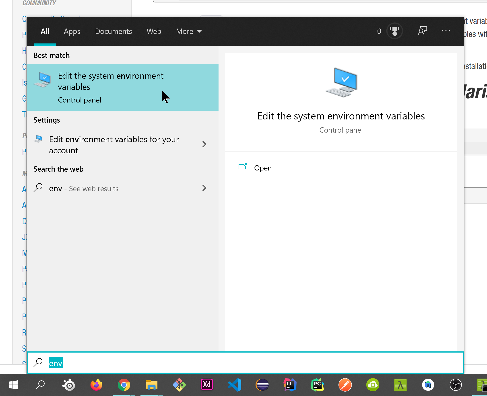
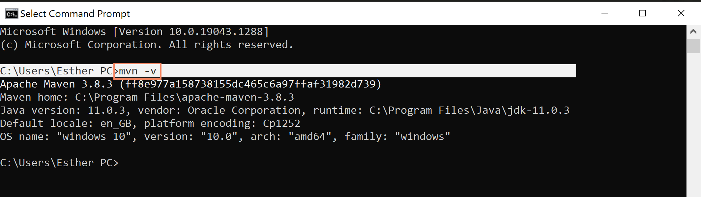

# LCM Calculator
## _*The Last API Ever, to find the LCM of a range of numbers*_


_...starting from 1_

## About Application
Finds the smallest number that can be divided by a sequential set of numbers:

Example: 1,2,3,4,5 = 60

"60 is the smallest number that can be divided by each of the numbers from 1 to 5 without any remainder.


## Usage
&nbsp;&nbsp;&nbsp;&nbsp;&nbsp;&nbsp;Use an http client like Postman to send the requests.

&nbsp;&nbsp;&nbsp;&nbsp;&nbsp;&nbsp;perform a GET-request to path: localhost:8080/LeastCommonMultipleTill, proceeded with a query parameter: till

&nbsp;&nbsp;&nbsp;&nbsp;&nbsp;&nbsp;Example: ```localhost:8080/LeastCommonMultiple?till=13```

&nbsp;&nbsp;&nbsp;&nbsp;&nbsp;&nbsp;The API will return a string containing ```360360 is the smallest number that can be divided by each of the numbers from 1 to 13 without any remainder.```

&nbsp;&nbsp;&nbsp;&nbsp;&nbsp;&nbsp;_Notes & Limits:_
 - _Insersing other than number will return statuscode of 400 - BAD Request_
 - _Note that its not possible to request a max-range greater then 42_
 - _Results of this application are tested based on the standards of [Calculator.net](https://www.calculator.net/lcm-calculator.html?numberinputs)_


## Run Project
Prerequisites: Maven is installed on the machine & the project is unzipped.

1. Navigate to the projects root directory /West - Assignment. (See that the pom.xml is located here)

2. Run command: ```mvn spring-boot:run```
	- To skip tests run: ```mvn -DskipTests spring-boot:run```
	- To quit application run: ctrl + c, Terminate Batch Job?: N (Kill PID if necessary)
3. Follow [usage instructions](#usage)


## Install Prerequisites
Prerequisites: Maven is installed on the machine & the project is unzipped.

**1. Install Project:**

[Install Project](https://github.com/1eam/Least_Common_Multiple_Calculator/archive/refs/heads/master.zip)
 
**2. Install maven:**
 	 
&nbsp;&nbsp;&nbsp;&nbsp;&nbsp;&nbsp;https://dlcdn.apache.org/maven/maven-3/3.8.3/binaries/apache-maven-3.8.3-bin.zip [Download of 03-11-21]
 
 
**3. Add Maven to classpath:**
 
&nbsp;&nbsp;&nbsp;&nbsp;&nbsp;&nbsp;Navigate to Environment Variables

 	
&nbsp;&nbsp;&nbsp;&nbsp;&nbsp;&nbsp;In the bottom tab (System Variables) search for 'Path'.
Double click and add the /apache-maven-3.8.3/bin directory

 
**4. Test succesful installation of maven:**
 
&nbsp;&nbsp;&nbsp;&nbsp;&nbsp;&nbsp;run: ```mvn -v``` response should look like:

&nbsp;&nbsp;&nbsp;&nbsp;&nbsp;&nbsp;Install reference: https://maven.apache.org/install.html#

## Considered Updates:
- Ability to calculate lcm of range x till x. Example: 3 - 45, 13 - 17, 19 - 23
- Ability to calculate lcm of x numbers. Where x are multiple random numbers. Example the LCM of 23, 4, 15 and 8 = 

## License

none

**✨Free Software :D✨**